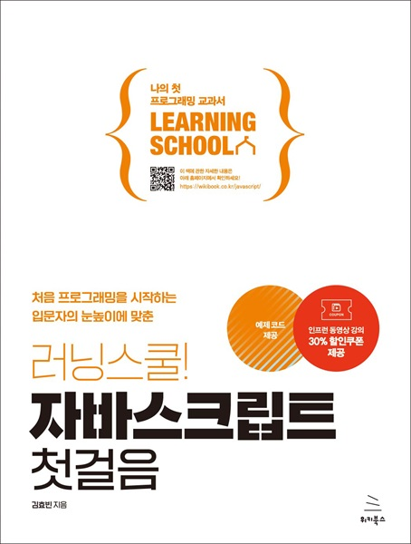

# 러닝스쿨! 자바스크립트 첫걸음
### 처음 프로그래밍을 시작하는 입문자의 눈높이에 맞춘

- **김효빈** 지음
- ISBN: 9791158395193
- 판형: 175\*235\*13mm
- 24,000원 | 2024년 5월 2일 발행 | 308쪽
- [책 홈페이지](https://wikibook.co.kr/javascript/)
- [도서 미리보기]()
- [도서 관련 문의](https://wikibook.co.kr/support/contact/)

---

**실무에 꼭 필요한 자바스크립트 필수 지식과 핵심 기술을 가장 쉽게 설명한 입문서!**

《러닝스쿨! 자바스크립트 첫걸음》은 자바스크립트의 기초부터 프런트엔드 개발의 최신 트렌드까지 웹 개발을 시작하려는 분들에게 필수적인 지식을 제공하는 책입니다. 현재 가장 인기 있는 기술인 React.js와 Next.js를 배우고 싶은 초보자부터, 이미 이 기술들을 다루고 있는 개발자 모두에게 적합합니다. 

실무에서 자주 사용되는 문법들을 위주로, 이해하기 쉬운 예제와 명확한 설명으로 기초적인 개념부터 심화 내용까지 단계별로 배울 수 있고, 이를 활용해 프로젝트를 개발하는 과정까지 다양한 예제와 친절한 설명으로 쉽게 이해할 수 있도록 도와주는 책입니다. 《러닝스쿨! 자바스크립트 첫걸음》을 통해 웹 개발에 첫걸음을 내딛어 보길 바랍니다.

**★ 이 책에서 다루는 내용 ★**

- 자바스크립트의 역사와 기초
- 자바스크립트 실행 환경 설정
- 자바스크립트 기본 문법
- 자바스크립트 심화 개념
- API 호출과 이벤트 처리
- DOM 조작
- 웹 페이지 개발 및 사용

**★ 참고 자료 ★**

- 인프런 강의: https://inf.run/7AC37

---
 
 ## 구입처
 
 - [예스24](https://www.yes24.com/Product/Goods/126190473)
 - [교보문고](https://product.kyobobook.co.kr/detail/S000213096985)
 - [인터파크](https://book.interpark.com/product/BookDisplay.do?_method=detail&sc.prdNo=356906514)
 - [알라딘](https://www.aladin.co.kr/shop/wproduct.aspx?ItemId=338587908)
